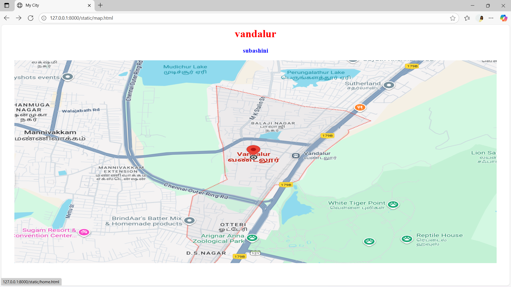
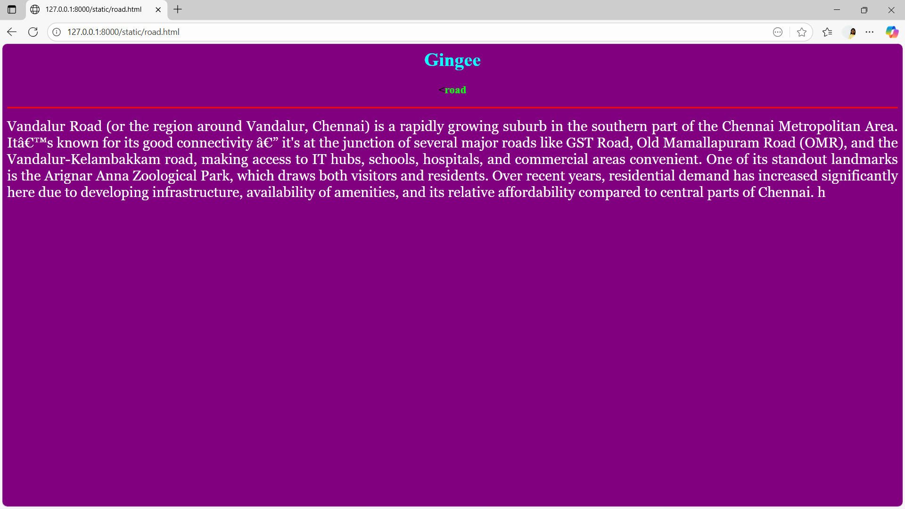
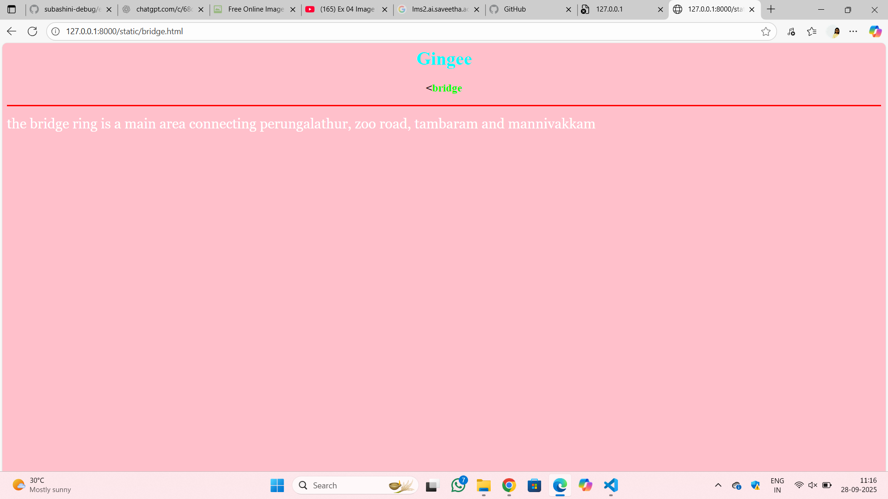
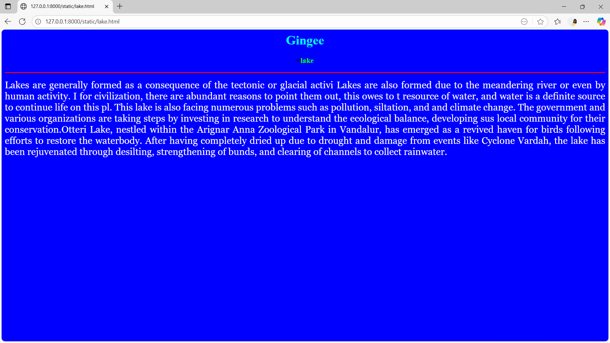
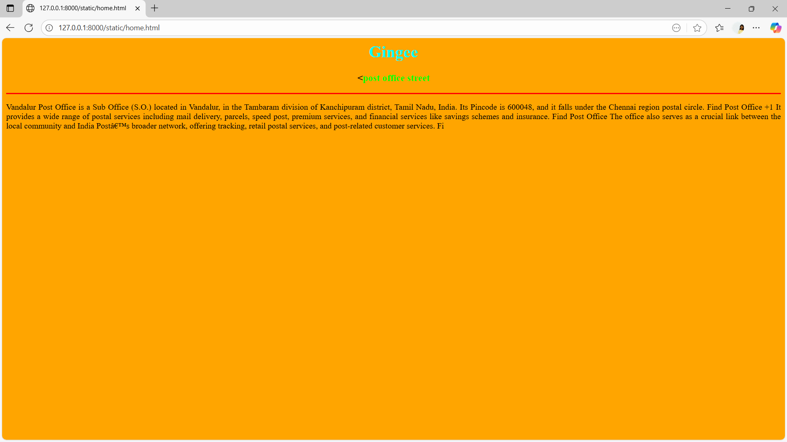

# Ex04 Places Around Me
## Date: 28.9.2025

## AIM
To develop a website to display details about the places around my house.

## DESIGN STEPS

### STEP 1
Create a Django admin interface.

### STEP 2
Download your city map from Google.

### STEP 3
Using ```<map>``` tag name the map.

### STEP 4
Create clickable regions in the image using ```<area>``` tag.

### STEP 5
Write HTML programs for all the regions identified.

### STEP 6
Execute the programs and publish them.

## CODE
```
<html>
<head>
<title>My City</title>
</head>
<body>
<h1 align="center">
<font color="red"><b>vandalur</b></font>
</h1>
<h3 align="center">
<font color="blue"><b>subashini</b></font>
</h3>
<center>

<map name="MyCity">


<map name="MyCity">
    <map name="image-map">
    <area target="_self" alt="lake" title="lake" href="lake.html" coords="552,467,854,653" shape="rect">
</map>
<map name="image-map">
    <area target="_self" alt="bridge" title="bridge" href="bridge.html" coords="381,286,683,472" shape="rect">
</map>
<map name="image-map">
    <area target="_self" alt="road" title="road" href="road.html" coords="301,334,403,591" shape="rect">
</map>

<map name="image-map">
    <area target="" alt="" title="post office" href="home.html" coords="533,241,635,498" shape="rect">
</map>
</map>
</center>
</body>
</html>


<html>

<body bgcolor="pink">

<h1 align="center">

<font color="cyan"><b>Gingee</b></font>


</h1>


<h3 align="center">

<<font color="lime"><b>bridge</b></font>

</h3>


<hr size="3" color="red">


<p align="justify">


<font face="Georgia" size="5" color="white">

the bridge ring is a main area connecting perungalathur, zoo road, tambaram and mannivakkam
 </font>

</p>


</body>


</html>


<html>

<body bgcolor="grey">

<h1 align="center">

<font color="cyan"><b>Gingee</b></font>


</h1>


<h3 align="center">

<<font color="lime"><b>road</b></font>

</h3>


<hr size="3" color="red">


<p align="justify">


<font face="Georgia" size="5" color="white">

Vandalur Road (or the region around Vandalur, Chennai) is a rapidly growing suburb in the southern part of the Chennai Metropolitan Area. It’s known for its good connectivity — it's at the junction of several major roads like GST Road, Old Mamallapuram Road (OMR), and the Vandalur-Kelambakkam road, making access to IT hubs, schools, hospitals, and commercial areas convenient. One of its standout landmarks is the Arignar Anna Zoological Park, which draws both visitors and residents. Over recent years, residential demand has increased significantly here due to developing infrastructure, availability of amenities, and its relative affordability compared to central parts of Chennai. 
h
 </font>

</p>

</body>


</html>


<html>

<body bgcolor="blue">

<h1 align="center">

<font color="cyan"><b>Gingee</b></font>


</h1>


<h3 align="center">

<<font color="lime"><b>lake</b></font>

</h3>


<hr size="3" color="red">


<p align="justify">


<font face="Georgia" size="5" color="white">

Lakes are generally formed as a consequence of the tectonic or glacial activi Lakes are also formed due to the meandering river or even by human activity. I for civilization, there are abundant reasons to point them out, this owes to t resource of water, and water is a definite source to continue life on this pl. This lake is also facing numerous problems such as pollution, siltation, and and climate change. The government and various organizations are taking steps by investing in research to understand the ecological balance, developing sus


local community for their conservation.Otteri Lake, nestled within the Arignar Anna Zoological Park in Vandalur, has emerged as a revived haven for birds following efforts to restore the waterbody. After having completely dried up due to drought and damage from events like Cyclone Vardah, the lake has been rejuvenated through desilting, strengthening of bunds, and clearing of channels to collect rainwater. 
 </font>

</p>

</body>


</html>


<html>

<body bgcolor="blue">

<h1 align="center">

<font color="cyan"><b>Gingee</b></font>


</h1>


<h3 align="center">

<<font color="lime"><b>lake</b></font>

</h3>


<hr size="3" color="red">


<p align="justify">


<font face="Georgia" size="5" color="white">

Lakes are generally formed as a consequence of the tectonic or glacial activi Lakes are also formed due to the meandering river or even by human activity. I for civilization, there are abundant reasons to point them out, this owes to t resource of water, and water is a definite source to continue life on this pl. This lake is also facing numerous problems such as pollution, siltation, and and climate change. The government and various organizations are taking steps by investing in research to understand the ecological balance, developing sus


local community for their conservation.Otteri Lake, nestled within the Arignar Anna Zoological Park in Vandalur, has emerged as a revived haven for birds following efforts to restore the waterbody. After having completely dried up due to drought and damage from events like Cyclone Vardah, the lake has been rejuvenated through desilting, strengthening of bunds, and clearing of channels to collect rainwater. 
 </font>

</p>

</body>


</html>


<html>

<body bgcolor="orange">

<h1 align="center">

<font color="cyan"><b>Gingee</b></font>


</h1>


<h3 align="center">

<<font color="lime"><b>post office street</b></font>

</h3>


<hr size="3" color="red">


<p align="justify">

Vandalur Post Office is a Sub Office (S.O.) located in Vandalur, in the Tambaram division of Kanchipuram district, Tamil Nadu, India. Its Pincode is 600048, and it falls under the Chennai region postal circle. 
Find Post Office
+1
 It provides a wide range of postal services including mail delivery, parcels, speed post, premium services, and financial services like savings schemes and insurance. 
Find Post Office
 The office also serves as a crucial link between the local community and India Post’s broader network, offering tracking, retail postal services, and post-related customer services. 
Fi

<font face="Georgia" size="5" color="white">


 </font>

</p>

</body>


</html>


 ```


## OUTPUT







## RESULT
The program for implementing image maps using HTML is executed successfully.
